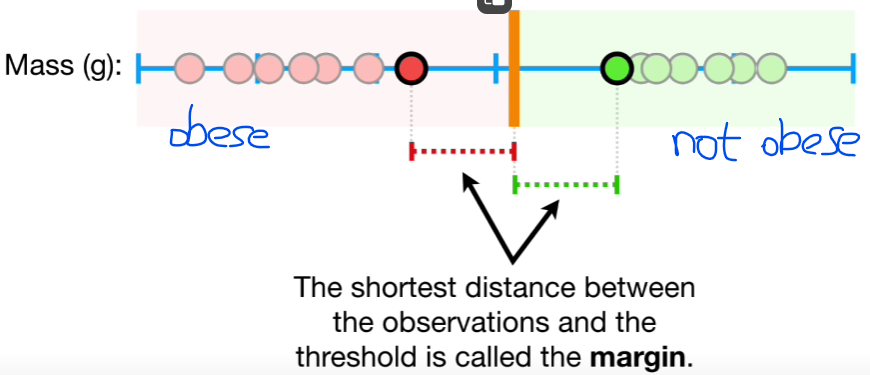
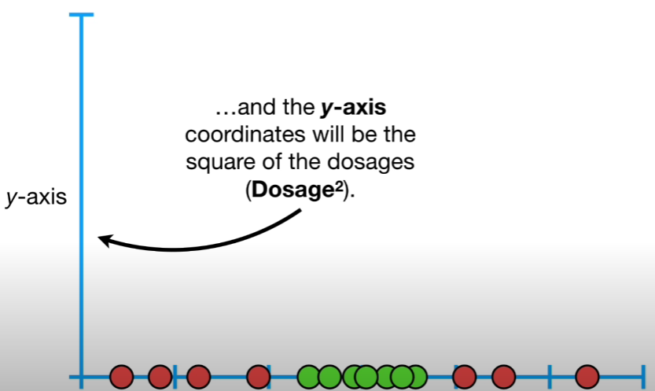

# Support Vector Machine

We find the observations on the edge of each cluster and use the midpoint between them as threshold. If a new point falling on the left regards as obese. Conversely, it can be viewed as not obese.

The shortest distance between the observations and the threshold is called the Margin. The margin on the left of threshold and on the right are same length. (Maximal Margin Classifier) Maximal Margin Classifier is super sensitive to outliers.

To make a threshold that is not so sensitive to outliers we must allow misclassification.

Choosing a threshold that allow misclassifications is an example of the bias/variance Tradeoff that plagues all of machine learning.

When we allow misclassification, the distance between the observations and the threshold is called a soft margin.

How to decide the location of thresholds?

1.  The answer is simple: we use CROSS VALIDATION to determine how many misclassifications and observations to allow inside of the soft margin to get the best classification.

2.  Then we are using a soft margin classifier aka a support vector classifer to classify observations.

The name SUPPORT VECTOR CLASSIFER comes from the fact that the observations on the edge and within the soft margin are called support vectors.

BUT, what if this was our training data and we had a ton of overlap?

-- red dots represent patients that were not cured. Black dots represent patients that were cured.

Now, no matter where we put the classifier, we will make a lot of misclassifications. So, SUPPORT VECTOR CLASSIFIERS don't perform well with this type data.

So, let's start by getting an intuitive sense of the main ideas behind SUPPORT VECTOR MACHINE.

1.  We add y-axis which is squared dosage.

2.  Add, now that data are 2-dimensional, we can draw a support vector classifier that separates the people who are not cared from people who are not cured.

QUESTION: Why we decided to create y-axis coordinates with $Dosage^2$, rather than $Dosage^3$, $Dosage^4$?

How do we decide to transform data?

--support vector machines use KERNAL FUNCTIONS to systematically find SUPPORT VECTOR CLASSIFIERS in high dimensions.

How kenal functions find support vector classifiers?

For the above example, I used the polynomial kernal, which has a parameter, d, which stands for the degree of the polynomial.

When d = 1, the Polynomial kernal computes the relationships between each pair of observations in 1-Dimension, and these relationships are used to find a support vector classifier.

When d = 2, the Polynomial kernal computes the relationships between each pair observations in 2-Dimension.

.....

We can find a good value for d with CROSS VALIDATION.

##Another way to find d is RADIAL KERNAL which is in infinite dimensions to find support vector classifier.
